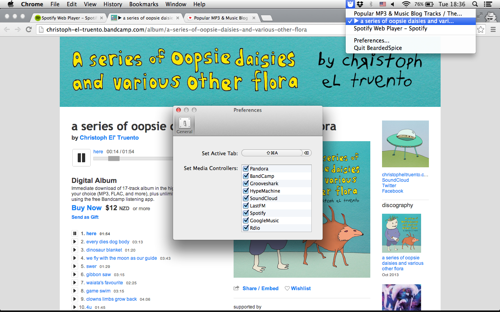

# Download

Download the [latest release](https://github.com/beardedspice/beardedspice/raw/releases/BeardedSpice-370342f1b1.app.tar.gz), or find all released binaries [here](https://github.com/beardedspice/beardedspice/tree/releases).

Mac OS X 10.7 or greater required.

[](https://travis-ci.org/beardedspice/beardedspice)

# About

[](images/bs.png)

BeardedSpice is a menubar application for Mac OSX that allows you to control web based media players with the media keys found on Mac keyboards. It is an extensible application that works with Chrome and Safari, and can control any tab with an applicable media player. BeardedSpice currently supports:

- [8Tracks](http://8tracks.com)
- [Amazon Music](https://amazon.com/gp/dmusic/cloudplayer/player)
- [BandCamp](http://bandcamp.com)
- [BeatsMusic](http://listen.beatsmusic.com)
- [Bop.fm](http://bop.fm)
- [Google Music](https://play.google.com/music/)
- [GrooveShark](http://grooveshark.com)
- [HypeMachine](http://hypem.com)
- [Last.fm](http://last.fm)
- [Mixcloud](http://mixcloud.com)
- [Music Unlimited ](https://music.sonyentertainmentnetwork.com)
- [Pandora](http://pandora.com)
- [Rdio](http://rdio.com)
- [Shuffler.fm](http://shuffler.fm/tracks)
- [Slacker](http://slacker.com)
- [Songza](http://songza.com)
- [SoundCloud](https://soundcloud.com)
- [Spotify (Web)](https://play.spotify.com)
- [Synology](http://synology.com)
- [XboxMusic](http://music.xbox.com)
- [YouTube](http://youtube.com)
- [VK ("My Music" from vk.com)](http://vk.com)
- [Vimeo](http://vimeo.com)

If you want another supported app supported, simply open an issue with the tag 'app support'. Or, if you are feeling extra feisty, implement the handler yourself!

BeardedSpice is built with [SPMediaKeyTap](https://github.com/nevyn/SPMediaKeyTap) and works well with other applications listening to media key events.

## Dependencies

We use [CocoaPods](http://cocoapods.org/) to manage all obj-c/cocoa dependences. Install them locally using:
```bash
sudo gem install cocoapods
pod install
```

*Always* use BeardedSpice.xcworkspace for development, *not* BeardedSpice.xcodeproject

## Features

### Setting an active tab
Tell BeardedSpice to control a tab by either clicking the menubar icon and selecting a tab from the dropdown, or by pressing the 'Set Active Tab' shortcut when a browser window is active. The shortcut defaults to ⌘+F8, and is configurable in the preferences panel. Switching active tabs will pause the currently active tab (if there is one).

In Chrome you must reset your active tab if you move your tab to a new window. With Safari, reset your active tab when changing the order of your active tab or moving it to a new window.

### Disabling certain handlers
From the preferences menu, uncheck any types of webpages that you don't want BeardedSpice to have control over. By default, all implemented handlers are enabled.

## Writing a Handler

Media controllers are written as [strategies](https://github.com/beardedspice/beardedspice/blob/master/BeardedSpice/MediaStrategy.h). Each strategy defines a collection of Javascript functions to be excecuted on particular webpages.

```Objective-C
@interface MediaStrategy : NSObject

-(BOOL) accepts:(id <Tab>) tab;
-(NSString *) displayName;

-(NSString *) toggle;
-(NSString *) previous;
-(NSString *) next;
-(NSString *) pause;

@end
```

The `accepts` method takes a `Tab` object and returns `YES` if the strategy can control the given tab. `displayName` must return a unique string describing the controller and will be used as the name shown in the Preferences panel. All other functions return a Javascript function for the particular action. `pause` is a special case and is used when changing the active tab.

A sample strategy for GrooveShark:

```Objective-C
@implementation GrooveSharkStrategy

-(id) init
{
    self = [super init];
    if (self) {
        predicate = [NSPredicate predicateWithFormat:@"SELF LIKE[c] '*grooveshark.com*'"];
    }
    return self;
}

-(BOOL) accepts:(id <Tab>)tab
{
    return [predicate evaluateWithObject:[tab URL]];
}

-(NSString *) toggle
{
    return @"(function(){return window.Grooveshark.togglePlayPause()})()";
}

-(NSString *) previous
{
    return @"(function(){return window.Grooveshark.previous()})()";
}

-(NSString *) next
{
    return @"(function(){return window.Grooveshark.next()})()";
}

-(NSString *) pause
{
    return @"(function(){return window.Grooveshark.pause()})()";
}

-(NSString *) displayName
{
    return @"Grooveshark";
}

@end
```

Update the [`MediaStrategyRegistry`](https://github.com/beardedspice/beardedspice/blob/master/BeardedSpice/MediaStrategyRegistry.m) to include an instance of your new strategy:

```Objective-C
+(NSArray *) getDefaultMediaStrategies
{
        DefaultMediaStrategies = [NSArray arrayWithObjects:
                                  // ...
                                  [[GoogleMusicStrategy alloc] init],
                                  [[RdioStrategy alloc] init],
                                  // add your new strategy!
                                  [[GrooveSharkStrategy alloc] init],
                                  nil];
}
```

Finally, update the [default preferences plist](https://github.com/beardedspice/beardedspice/blob/master/BeardedSpice/BeardedSpiceUserDefaults.plist) to include your strategy.

## Contact

- [@chedkid](https://twitter.com/chedkid)
- [@trhodeos](https://twitter.com/trhodeos)
