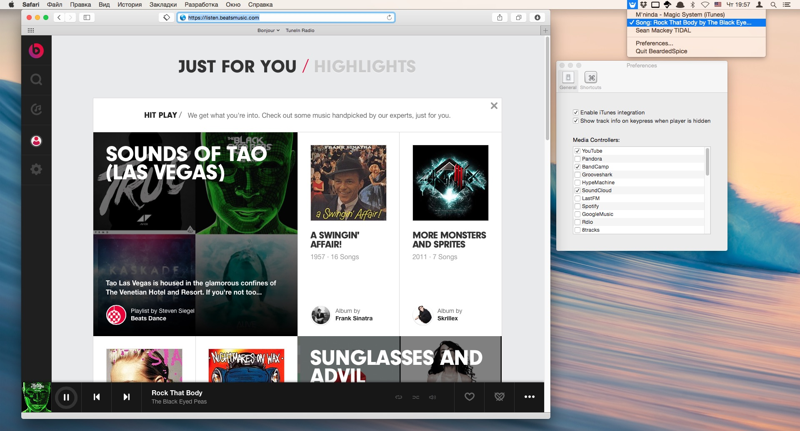

# Users Guide

[](images/bs.jpg)

## What?
BeardedSpice allows you to control web based media players (Like *SoundCloud*, and *YouTube* ... [List of supported sites to date](#supported-sites)) and some native apps with the media keys found on Mac keyboards.

## How?
All you need to do is just open your favorite [supported media site](#supported-sites) in either Chrome or Safari, then click on BeardedSpice's Menubar icon  and select the website you want to control using your media keys.

#### Interested in doing it with a keyboard-shortcut?
We've got you covered, give the [Shortcuts section](#keyboard-shortcuts) a look below!

## Download

Ready to give BeardedSpice a spin? You can download the [latest release here](https://raw.github.com/beardedspice/beardedspice/distr/publish/releases/BeardedSpice-latest.zip)*, or find a full list of all our [previously released binaries here](https://github.com/beardedspice/beardedspice/releases).

*Mac OS X 10.8 or greater required.

## Features

### *Smart* Mode
> This feature is a **work-in-progress**, we are currently working on bringing it to all our supported sites!

BeardedSpice tries to automatically guess which tab it should control for you. When you press any media key or BeardedSpice shortcut with BeardedSpice open, it will automatically control the site currently playing media, if you have no playing sites, it will try to control the currently focused tab (if it is one of our supported sites) if BeardedSpice failed to do either, it will automatically control the first.

### Automatic Updates
No more checking for new releases on our website, BeardedSpice will automatically notify you when a new release is available.

### Keyboard Shortcuts
BeardedSpice comes with a handy list of Keyboard Shortcuts that can be configured under the `Shortcuts` tab of BeardedSpice Prefrences (available through the menubar icon). Here is a table of Default Keyboard Shortcuts:

Default Shortcut | Action
:---------------:|:------:
`⌘` + `F8` |  Set Focused Browser tab as *Active Player* (effectively directing your commands to that tab)
`⌘` + `F6` | Focus *Active Player* (Shows the tab currently controled by BeardedSpice)
`⌘` + `F10` | Toggle Favorite (Add currently playing track to your favorites on it's site)
`⌘` + `F11` | Show Track information (shows a notification with info about the currently playing tab)

### Multimedia keys of non-Apple keyboards
Using a 3rd-party keyboard? Or even a keyboard with no multimedia keys? No problems, BeardedSpice allows you to set your multimedia keys under the shortcuts tab, so you can use any key (or key combination) of your liking.

### Disabling certain handlers
From the preferences tab, uncheck any types of webpages that you don't want BeardedSpice to have control over. By default, all implemented handlers are enabled.

### Supported Mac OS X applications
- [iTunes](http://www.apple.com/itunes/)
- [Spotify](http://www.spotify.com/)
- [VOX](http://coppertino.com/)

### Supported Sites
- [8Tracks](http://8tracks.com)
- [22Tracks](http://22tracks.com)
- [Amazon Music](https://amazon.com/gp/dmusic/cloudplayer/player)
- [Audible](http://www.audible.com/)
- [AudioMack](http://www.audiomack.com/)
- [BandCamp](http://bandcamp.com)
- [BBC Radio](http://www.bbc.co.uk/radio)
- [Beatguide](http://beatguide.me/)
- [BeatsMusic](http://listen.beatsmusic.com)
- [Blitzr](http://blitzr.com)
- [Bop.fm](http://bop.fm)
- [Chorus](http://wiki.xbmc.org/index.php?title=Add-on:Chorus)
- [Coursera](https://www.coursera.org)
- [Composed](https://www.composed.com/)
- [Deezer](http://deezer.com)
- [Digitally Imported](http://www.di.fm/)
- [focus@will](https://www.focusatwill.com)
- [Google Music](https://play.google.com/music/)
- [GrooveShark](http://grooveshark.com)
- [HotNewHipHop Mixtapes] (http://www.hotnewhiphop.com/mixtapes/)
- [HypeMachine](http://hypem.com)
- [IndieShuffle](http://www.indieshuffle.com)
- [Jango](http://jango.com)
- [Kollekt.FM](https://kollekt.fm/)
- [Last.fm](http://last.fm)
- [Le Tournedisque](http://www.letournedisque.com/)
- [Logitech Media Server](http://www.mysqueezebox.com/) (`Default` web interface only)
- [Mixcloud](http://mixcloud.com)
- [Music For Programming](http://musicforprogramming.net/)
- [Music Unlimited](https://music.sonyentertainmentnetwork.com)
- [Netflix](http://www.netflix.com)
- [NoAdRadio.com](http://noadradio.com)
- [NoonPacific.com](http://noonpacific.com)
- [NRK Radio](http://radio.nrk.no/)
- [Odnoklassniki](http://ok.ru)
- [Overcast.fm](https://overcast.fm)
- [Pandora](http://pandora.com)
- [Plex Web](https://app.plex.tv)
- [Pocket Casts](https://play.pocketcasts.com/)
- [Rdio](http://rdio.com)
- [Rhapsody](http://rhapsody.com)
- [Saavn](http://saavn.com)
- [Shuffler.fm](http://shuffler.fm/tracks)
- [Slacker](http://slacker.com)
- [SomaFM](http://somafm.com)
- [Songza](http://songza.com)
- [SoundCloud](https://soundcloud.com)
- [Spotify (Web)](https://play.spotify.com)
- [STITCHER](http://www.stitcher.com)
- [Subsonic (personal media streamer)](http://www.subsonic.org/)
- [Synology](http://synology.com)
- [TIDAL (Web)](http://listen.tidalhifi.com/)
- [TuneIn](http://tunein.com/)
- [Udemy](https://www.udemy.com/)
- [Vimeo](http://vimeo.com)
- [VK ("My Music" from vk.com)](http://vk.com)
- [WONDER.FM](http://wonder.fm/)
- [XboxMusic](http://music.xbox.com)
- [Yandex Music](http://music.yandex.ru)
- [Yandex Radio](http://radio.yandex.ru)
- [YouTube](http://youtube.com)

#### Don't see your favorite site in the list ?
No Problem, Just [submit an issue](https://github.com/beardedspice/beardedspice/issues/new?title=[App%20Support]). Or, if you're in the mood to try something new, just follow the [Developers' Guide](#developers-guide) below and write your own *media strategy*, integrating a new app in BeardedSpice is really easy and requires minimal objective-c experience and a little of JavaScript basics.


---

#Developers' Guide

## Dependencies

We use [CocoaPods](http://cocoapods.org/) to manage all obj-c/cocoa dependences. cd to the directory containing the workspace, then install them locally using:
```bash
sudo gem install cocoapods
pod setup
pod install
```

*Always* use `BeardedSpice.xcworkspace` for development, *NOT* `BeardedSpice.xcodeproject`

BeardedSpice is built with [SPMediaKeyTap](https://github.com/nevyn/SPMediaKeyTap) and works well with other applications listening to media key events.


## Writing a *MediaStrategy*

Media controllers are written as [strategies](https://github.com/beardedspice/beardedspice/blob/master/BeardedSpice/MediaStrategy.h). Each strategy defines a collection of Javascript functions to be excecuted on particular webpages.

```Objective-C
@interface MediaStrategy : NSObject
/**
Returns the name of that media strategy.
*/
-(NSString *) displayName; // Required override in subclass.

/**
Checks tab to see if it is accepted by this strategy.
*/
-(BOOL) accepts:(TabAdapter *)tab; // Required override in subclass.

/**
Checks tab to see if it is currently playing audio.
*/
- (BOOL)isPlaying:(TabAdapter *)tab;

/**
Returns track information object from tab. More information below.
*/
- (Track *)trackInfo:(TabAdapter *)tab;

/**
Returns Javascript code for the play/pause toggle.
*/
-(NSString *) toggle; // Required override in subclass.

/**
Returns javascript code for the previous track action.
*/
-(NSString *) previous;

/**
Returns javascript code for the next track action.
*/
-(NSString *) next;

/**
Returns javascript code for the pausing action.
Used mainly for pausing before switching active tabs.
*/
-(NSString *) pause; // Required override in subclass.

/**
Returns javascript code of the "favorite" toggle.
*/
-(NSString *) favorite;

/**
Helper method for obtaining album artwork from url string
*/
- (NSImage *)imageByUrlString:(NSString *)urlString;

@end
```

The `accepts` method takes a `Tab` object and returns `YES` if the strategy can control the given tab. `displayName` must return a unique string describing the controller and will be used as the name shown in the Preferences panel. Some other functions return a Javascript function for the particular action. `pause` is a special case and is used when changing the active tab. Optional but useful methods are `isPlaying` and `trackInfo`. If you define the `isPlaying` method, the media strategy will be used in autoselect mechanism, a description of which you may find in issue #67. The `trackInfo` method returns a `Track` object, which used in notifications for the user.

Define these properties of the `Track` object:
```Objective-C
@property NSString *track;
@property NSString *album;
@property NSString *artist;
@property NSImage *image;
@property NSNumber *favorited;
```

A sample strategy for YandexMusic:

```Objective-C
@implementation YandexMusicStrategy

- (id)init {
    self = [super init];
    if (self) {
        predicate =
            [NSPredicate predicateWithFormat:@"SELF LIKE[c] '*music.yandex.*'"];
    }
    return self;
}

- (BOOL)accepts:(TabAdapter *)tab {
    return [predicate evaluateWithObject:[tab URL]];
}

- (BOOL)isPlaying:(TabAdapter *)tab {

    NSNumber *value =
        [tab executeJavascript:@"(function(){return "
                               @"JSON.parse($('body').attr('data-unity-state')"
                               @").playing;})()"];

    return [value boolValue];
}

- (NSString *)toggle {
    return @"(function(){document.querySelector('div.b-jambox__play, "
           @".player-controls__btn_play').click()})()";
}

- (NSString *)previous {
    return @"(function(){document.querySelector('div.b-jambox__prev, "
           @".player-controls__btn_prev').click()})()";
}

- (NSString *)next {
    return @"(function(){document.querySelector('div.b-jambox__next, "
           @".player-controls__btn_next').click()})()";
}

- (NSString *)pause {
    return @"(function(){\
        var e=document.querySelector('.player-controls__btn_play');\
        if(e!=null){\
            if(e.classList.contains('player-controls__btn_pause')){e.click()}\
        }else{\
            var e=document.querySelector('div.b-jambox__play');\
            if(e.classList.contains('b-jambox__playing')){e.click()}\
        }\
    })()";
}

- (NSString *)displayName {
    return @"YandexMusic";
}

- (NSString *)favorite {

    return @"(function(){$('.player-controls "
           @".like.player-controls__btn').click();})()";
}

- (Track *)trackInfo:(TabAdapter *)tab {

    NSDictionary *info = [tab
        executeJavascript:@"(function(){return "
                          @"$.extend(JSON.parse($('body').attr('data-unity-"
                          @"state')), ({'favorited': ($('.player-controls "
                          @".like.like_on.player-controls__btn').length)}))})("
                          @")"];

    Track *track = [Track new];

    track.track = info[@"title"];
    track.artist = info[@"artist"];
    track.image = [self imageByUrlString:info[@"albumArt"]];
    track.favorited = info[@"favorited"];

    return track;
}

@end
```

Update the [`MediaStrategyRegistry`](https://github.com/beardedspice/beardedspice/blob/master/BeardedSpice/MediaStrategyRegistry.m) to include an instance of your new strategy:

```Objective-C
+(NSArray *) getDefaultMediaStrategies
{
        DefaultMediaStrategies = [NSArray arrayWithObjects:
                                  // ...
                                  [GoogleMusicStrategy new],
                                  [RdioStrategy new],
                                  // add your new strategy!
                                  [YandexMusicStrategy new],
                                  nil];
}
```

Finally, update the [default preferences plist](https://github.com/beardedspice/beardedspice/blob/master/BeardedSpice/BeardedSpiceUserDefaults.plist) to include your strategy.

# About pull requests
Any progressive improvement is welcome. Also if you are implementing a new strategy, take the trouble to implement all methods from modern API of the strategies please. PR with strategy that are not fully implemented for no reason will be rejected.

[](https://travis-ci.org/beardedspice/beardedspice)

# Contact

- [@chedkid](https://twitter.com/chedkid)
- [@trhodeos](https://twitter.com/trhodeos)
